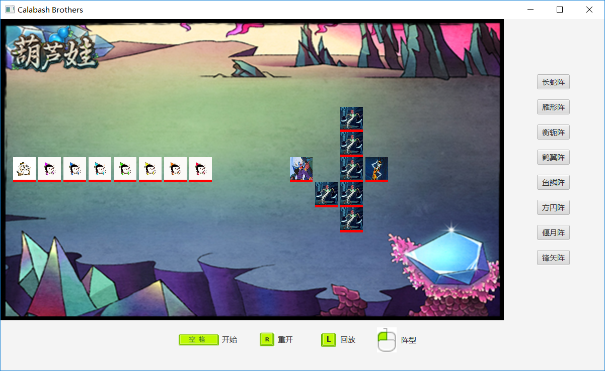
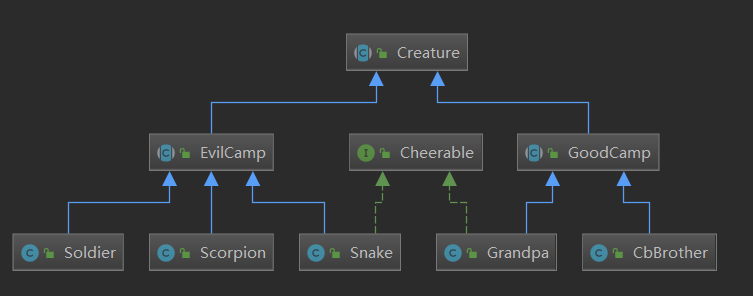

# Final Project —— 葫芦娃大战妖精 #

* 161220024 成威		email:<a href="mailto:2509212623@qq.com">2509212623@qq.com</a>

## 开发环境 ##
* Java jdk1.8.0_192
* IntelliJ IDEA 2018.3
* Maven 3.6.0
* 执行`mvn clean test package`在target目录下获取 葫芦兄弟.jar 文件,双击运行即可

## 应用简介 ##

* 游戏开始前，玩家可以通过点击右侧的按钮选择葫芦娃的阵型，妖精的阵型随机生成
* 按空格键开始游戏，葫芦娃和妖精自动进行战斗
* 游戏开始前或游戏结束后，可以通过`R`键重置游戏状态
* 游戏开始前或游戏结束后，可以通过`L`键选择记录文件进行回放

## 项目代码 ##
### 文件目录 ###
- demo：放置README.md中用到的图片
- record：存放记录文件，用于回放战斗
- src/main/java:项目源代码
- src/main/resources:项目资源文件
- src/test/java/unit:单元测试代码

### 源代码类结构 ###
#### myworld.creature ####
这个package中存放 *生物体* 有关的类，继承关系如下：


* Creature分为EvilCamp和GoodCamp，且都定义为abstract类，阻止产生"不明生物"的对象  
* CbBrother和Grandpa 属于(is-a) GoodCamp，Soldier、Scorpion和Snake 属于(is-a) EvilCamp  
* GrandPa和Snake都具有cheer动作，用Cheerable接口对动作进行抽象

#### myworld.battlefield ####
这个package中存放 *战场* 相关的类  
* `Position`是二维空间位置的基本单位，每个位置上可且仅可站立一个生物体;使用泛型，边界限定为Creature  
```java
public class Position<T extends Creature> {
    private T body;

    Position() {body=null;}

    public T getBody() {return body;}

    void setBody(T body) {this.body=body;}
}
```  
* `BattleField`即为二维空间类，"has-a" Position[][] 空间，有一系列关于二维空间的API  
```java
public class BattleField {
    public static final int ROW=11;
    public static final int COL=19;
    public static final Pos CENTRE=new Pos(0,COL/2);              //战场相对于布阵的中心点

    private Position<Creature>[][] field=new Position[ROW][COL];  //二维空间

    private int goodNum;      //葫芦娃阵营存活数量
    private int evilNum;      //妖精存活数量

    private Record record;    //记录文件

    /* ... */
}
```  

#### myworld.formation ####
这个package中存放 *阵型*相关的类  
* `FormationInfo`提供API，用于获取给定阵营在二维空间上的位置
```java
public class FormationInfo {
    private Pos cheerPos;                   //老爷爷/蛇精位置
    private Pos leadPos;                    //大娃/蝎子精位置
    private Pos[] otherPos=new Pos[6];      //葫芦娃/小喽喽位置
    private final Camp CAMP;                //用此阵型的阵营
    private final Pos CENTRE;

    public FormationInfo(Camp camp,Pos pos){/* ... */}
    
    /* ... */
    
    public void setFormationPos(Formation formation){/* ... */}
}
```  

#### gui ####
这个package中存放与应用运行直接相关的几个类  
* `Main`是整个项目的入口，也是JavaFX框架的启动处
* `Controller`是JavaFX框架的控制器，UI界面的事件响应函数及游戏的运行控制在其中
* `Record`是用于记录回放文件的类，每场战斗有一个相对应的Record对象进行记录，显然Record对象是多线程的共享资源
```java
public class Record {       //线程共享资源
    private static final String DIRPATH="./record";       //record目录
    private String filePath;                              //此次记录的路径
    private BufferedWriter out;

    private List<String> recordList=new ArrayList<>();    
    private boolean isClose=false;

    public Record(){/* ... */}

    public synchronized void recordFormation(String goodFormation,String evilFormation){/* ... */}

    public synchronized void recordMove(String name,int x,int y){/* ... */}

    public synchronized void recordAttack(String attacker,String target){/* ... */}

    public synchronized  void recordDead(String name){/* ... */}

    public synchronized void recordOver(){/* ... */}
}
```  
* `CreatureThread`是生物体战斗的线程，控制生物体在战斗过程中的所有行为

## Java机制体现 ##
### 异常处理 ###
除去Java包方法使用中需要处理的异常外，项目中还自定义了两个异常，用于处理使用中可能遇到的问题  
* `CreatException`：用于限定生物体对象创建的个数（动画中葫芦娃7个，爷爷、蝎子精和蛇精各1个，小喽啰在游戏中限定为6个），一旦超出则在各个生物体的构造函数中抛出异常
* `RecordException`：用于指示记录文件不正确，当读取记录文件格式不正确或记录有误（被修改过）时抛出异常
```java
public class RecordException extends Exception {
    RecordException(){
        super("Failed to load the record.");
    }
}
```

### 集合类型 ###
记录文件中记录了生物体的名字，回放时读取记录文件需要将该名字对应到相应的生物体对象，而总共16个生物体对象使用`switch`语句显然效果不佳。故使用HashMapz在游戏初始化阶段进行put，名字作为Key,相对应的生物体对象引用作为其Value。读取文件时通过get()方法即可获取对应的生物体对象  
```java
private HashMap<String,Creature> creatureMap;
```

### 泛型 ###
二维空间位置Position用到泛型指定可放置的类型范围

### 注解 ###
项目中没有自定义注解，使用了`@Override`,`@Deprecated`标识类中的某些方法，借此从编译器处获得帮助  

### 输入输出 ###
玩家通过UI界面对游戏进行操作，输入输出体现在*回放文件*的记录和读取，通过`BufferReader`和`BufferWriter`进行输入输出  

### 多线程 ###
每个生物体为一个线程，需要控制多线程对共享资源的访问、不能出现饥饿现象（某线程始终无法获取CPU），应当实现为回合制，即每个回合内每个生物体都能进行一次攻击和移动，且每次操作后都要释放CPU，回到主线程更新UI（在子线程中只能使用`Platform.runLater()`更新界面且需要主线程获取CPU空闲后再执行）
* 共享资源（生物体血量、二维空间信息、记录文件等）设为`private`，并将所有对共享资源的访问操作设为`synchronized`
* 线程每次操作(攻击或移动)后通过sleep将CPU释放给其他线程

### 单元测试 ###
在`src/test/java/unit`中分别继承了`BattleField`和`FormationInfo`类，用`@Test`测试了'inField()'对位置是否在二维空间中及`setFormationPos()`部分阵型的位置信息是否正确

## 功能实现 ##
主要介绍 生物体线程在战斗过程中的行为 和 回放文件的记录和读取
### 生物体线程 ###
* 在Creature中添加ImageView和Rectangle的两个变量，分别用来在UI上显示生物体和其血量，当生物体血量改变时通过`Platform.runLater()`设置动画改变Rectangle变量的width，其width即代表当前血量，移动位置时同理设置动画改变ImageView和Rectangle的位置，攻击时则绘制一个Circle移动到攻击目标上，生物体死后会将ImageView旋转180度并将亮度减半。
* 线程实现`run()`，生物体能攻击到战场上的每一个生物，但不同位置的伤害会有所差异，会选择攻击伤害最大化的目标：  
```java
int dec=Math.abs(getY()-creature.getY())+9*Math.abs(getX()-creature.getX());    //距离越远伤害减少得越多
if(dec>0.6*atk)   dec=(int)(0.6*atk);        //最少造成40%的伤害
dec=atk-dec;
```
攻击完后会执行`sleep()`，将CPU资源释放给下一个生物体，当所有生物体执行完`attack()`后会执行主线程，将所有UI动画完成，所以这些攻击看起来是同时发生的
* 随后sleep结束，子线程重新获取CPU，朝刚才攻击的目标移动一格（只能向前、向上或向下，战场中间设置了不可逾越的"楚河汉界"），同上执行`sleep()`释放CPU，所以这些移动看起来也是同时发生的
* 即所有生物"同时"攻击、随后"同时"移动作为一个回合，线程run的过程即为重复执行回合直至死亡
* 战场信息包括有两个阵营存活生物体的个数，一旦一方存活数为0，则所有在执行的子线程会在下一个回合开始时结束

### 回放 ###
* 首先，为了防止主线程关闭后子线程仍在后台执行，将所有子线程`setDaemon(true)`，但在战斗过程中将每条记录直接写入buffer的话，一旦主线程被关闭则创建的记录文件会是不完整的，这将带来读取问题。所以战斗过程中的记录先写入`Record`对象的集合中，战斗结束后再一起写入文件
```java
private List<String> recordList=new ArrayList<>();
```
* 我在读取记录文件上做了很多异常处理，以应对记录的不可控变化。首先文件选择器是限定读取.txt文件的，但是txt文件可以是任意内容，也可以是人为修改了记录文件后的内容（例如将"大娃"改为"红娃"），所以对每条记录都进行了检查，一旦出现不正确的记录就`throw new RecordException()`，同时`restart()`
* 记录文件显然是顺序存放的，为了尽可能还原战斗过程，根据战场上存活生物体数进行读取和`sleep()`，尽量还原了并发执行的效果

## 不足与思考 ##
* 因为时间分配上的原因，项目重构的次数较少、质量也不佳，实现完功能后再看整个代码结构，属实有不少违背面向对象设计原则的地方，而这些违背原则的设计正是当时实现功能时感到棘手的原因：
1. SRP：生物体类承担的职责不单一，不仅要作为生物体，还要承担UI显示的控制，这也导致Creature的构造函数中需要ImageView和Rectangle的对象，相当于Creature类只能在需要UI的场景下使用，显然会削弱其作为生物体的职责；或许在另开一个子线程定时根据战场和生物体信息刷新UI，将两个职责分开会更好
2. OCP：有一些比较奇怪的设计，比如BattleField的长宽是static final的，那这就是一个限定大小的战场类，显然不利于复用，对更改不是封闭的
3. LSP：替换原则在代码中体现得较好，Creature及其子类GoodCamp和BadCamp都实现为了抽象类
4. ISP：类与类之间耦合较多，接口过于臃肿，单一类受限于信息不足，需要大量与外部的交互，而过多的交互往往会导致代码逻辑混乱
5. DIP：各个package间的依赖关系不是通过抽象产生的，经常存在于各个实现类之间
6. SARP：项目中优先使用了对象合成/聚合，对"has-a"和"is-a"的关系区分较好
* 违背设计原则的后果往往体现在类的接口上，我在设计过程中经常会为了更方便地实现某个功能而修改、添加接口，很容易忽视设计原则(这应该是面向过程程序设计的习惯)，往往一个接口只能用于一个功能，且因为过度耦合导致复用性也很差，逻辑也会很复杂，Creature类耦合UI显示控制就导致我调了很多bug，甚至为了迎合这样的实现还导致了其他类的实现也过度耦合。
* 为此我深感复用性好的面向对象代码设计的困难与重要性，便不谨慎地提出一点意见：可以考虑在平时作业或者最后实验中按照要求实现满足设计原则的类及其API，给自己的API写文档提供给别人使用，或许这样更能感受到设计原则的重要性。
* Java面向对象的程序设计是在另一个角度考虑设计，其复用性也有着令人着迷的魔力，从这门课学到了很多，虽然在这次大作业上表现得挺差。希望自己能有更好的面向对象的思维方式。
